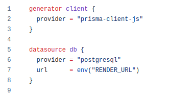

# Zenless Zone Zero Progress Planner API

This is a REST API, for my Zenless Zone Zero progress tracker. Its main function is to interact with the PSQL database and function as a backend. The API has CRUD (Create, Read, Update, and Delete) functionality for user profiles. Accounts, which are linked to user profiles, can be read and updated. Character and W-engine information can only be read. The API is meant to provide the client with relevant information and save user data.

# How to run locally

1.Clone the repository  
2.Enter the repository directory  
3.Run the build command: npm install  
4.Set Up your PSQL Database and PrismaORM  
5.Set up PSQL url  
&emsp;a.In an env file create an environment variable to hold your url  
&emsp;  
&emsp;b.In schema.prisma located in /zzz-planner-api/prisma enter your url. Replace env("RENDER_URL") if needed.  
6.Run the following commands:  
&emsp;a.npx prisma generate  
&emsp;b.npx prisma migrate dev --name init  
7.Seed the database: npx prisma db seed  
8.Return to /zzz-planner-api/  
9.Run the API: node app.js  
